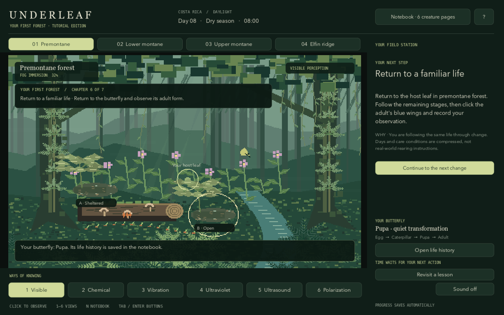

# Underleaf

[Play the browser demo](https://msfancypants07.github.io/Underleaf/) · [Download for Mac](https://github.com/msfancypants07/Underleaf/releases/latest/download/Underleaf-macOS.zip) · [Release notes](https://github.com/msfancypants07/Underleaf/releases/latest)



**Your First Forest** is a guided educational tutorial for macOS, made with
**Godot 4.4.1 / GDScript**. The small roster now supports a finite story: observe
hidden life, investigate shelter, and follow a butterfly from egg to adult.
`GAME_DESIGN.md` v5 is the current specification; the linked Google Doc is the
historical v2 source. §20 supersedes earlier onboarding and tutorial-ending rules.

## Play

Open **builds/Underleaf.app** in Finder. The engine and game are bundled; no
Godot installation, terminal, network, or account is needed to play.
This build is locally ad-hoc signed, not Apple-notarized for public distribution.
It was built and tested on Apple Silicon macOS.

**Existing forests are preserved in free exploration.** To play the new opening,
open **? → Begin a fresh tutorial → Save backup & begin**. The current forest is
backed up first. Review tutorial lessons at any time without resetting progress.

A new forest follows seven chapters:

1. Notice moving leaves. Click the outlined ants before recording them.
2. Deliberately switch to chemical perception and follow their hidden route.
3. Compare equally wet patches, change cover at the open patch, and repeat.
4. Prepare the surrounding host patch and return tomorrow to find a butterfly egg.
5. Practice the existing treehopper → bee → moth → scarab → ridge sequence.
   Each encounter explains its newly unlocked view. Field visits advance a game
   day and preserve the butterfly's stage changes in its life history.
6. Return home; advance to the next stage, restore conditions if needed, and
   inspect and record the adult butterfly in visible light.
7. Celebrate **Tutorial complete**. Continue exploring, review lessons, or try
   stewardship. The extra orchid-bee page is optional, not an ending requirement.

The chapter guide explains the next action and its purpose. Outlines locate the
current encounter. Tutorial time advances only through explicit actions; reading
or leaving the window cannot consume a life stage. All sense unlocks require the
player to choose the view, rather than silently switching it.

**1–6** choose unlocked views; **N** opens the notebook; **J** opens the study
journal; **Escape** closes a page; **F11** toggles fullscreen. **Tab / Shift-Tab**
and **Enter** navigate buttons. Sound can be muted. The notebook groups creature
pages, the relationship study, and butterfly life history. Life history keeps all
stage records and displays the five most recent entries.

After the tutorial (or in an existing forest), **Habitat / H** exposes the full
habitat sliders, and **Resume / Space** controls automatic time. Zones retain
separate conditions. Night opens after the moth. Completing eight creature pages
also retains the original free-exploration stewardship route.

## The Patch That Holds the Mist

The tutorial guides this study after the ants. In free exploration, choose
**Inquiry** in premontane forest; the study remains optional there.

1. Use **Chemical** perception and inspect the route around the log (**T**).
2. Return to **Visible** perception and inspect the forked-stem patch (**A**) and
   the patch at the opening (**B**). You can also click them in the forest.
3. Optionally make a prediction. Begin the first matched observation interval.
4. Watch the patches change or use **Observe one hour later**. Both patches start
   equally wet; every hourly observation is kept, even if you skip a day.
5. Open the journal (**J**) and compare the final four-hour view. Preview and
   encourage shelter at B. A remains unchanged. Allow the compressed growth interval
   to pass, then begin the matched repeat.
6. Compare the two intervals and record **A Shelter That Holds**, a relationship
   plate. Predictions and reflections are optional and never graded.

You can leave the zone, pause, close the app, or skip days. The study and its
observations persist. Repeating the observation retains the habitat change,
original evidence, and earned plate. The relationship does **not** count as a new
species. It advances a tutorial chapter and remains separate from the creature-page count.

**Tab / Shift-Tab** and **Enter** navigate buttons. The help page offers reduced
motion and patch labels. The journal can reveal the underlying model units;
normal play does not require matching percentages. Progressive hints are optional.

This is one authored **illustrative experiment**: local study patches have their
own shelter and water state, separate from the surrounding zone's habitat sliders.
They use a fixed wetting/drying sequence; the surrounding forest continues its
usual calendar. Evidence snapshots are preserved at interval boundaries, not
silently replaced by later weather. Eight model hours of growth are compressed
for play, not a real biological timetable. The study tests modeled retention,
not fog interception or ant habitat preference. Scientific review and formative
human playtesting are still the next steps; a ten-minute experience is a pacing
target, not a validated playtest result.

## Included in this first playable edition

- Four procedurally drawn elevation zones and an unlockable night layer.
- Visible light plus chemical, vibration, UV, ultrasound, and polarization modes.
  Each sense has separately drawn information, hidden encounters, and distinct
  scene palettes. Earlier zones retain discoveries as new senses open.
- Seven species, eight notebook plates (one species has a second optical study).
- A complete linear acquisition path, optional discoveries, sources, and visible
  confidence / uncertainty notes.
- Local habitat controls, accelerated time, day skipping, mist, and a repeating
  dry / rain-transition / wet calendar. All zones simulate each day.
- A full compressed morpho egg → four larval instars → pupa → adult cycle.
  Safe imperfect care lowers condition and adult visual size. Three consecutive
  days of extreme exposure cause loss; restoring habitat permits another egg.
- Notebook epilogue and gradual moisture pressure offset by four restoration actions.
- Separate original vector field plates, procedural pixel forest art, an app icon,
  and synthetic audible sensory cues.
- Versioned, atomic local saves every 15 seconds, after actions, and on normal quit.

## Scope and scientific limits

This is a **first playable edition**, not the document's full 25–35-species v1.
The environment art is procedural; the plates are stylized illustrations. Sounds
are synthesized examples, not licensed field recordings or identification keys.
The current ecology is intentionally simplified: thresholds and eight-day rearing
are game rules, and discovery cues can be narrative translations rather than an
animal's literal sensory ability. Some species/elevation placements remain
provisional; read each plate's uncertainty note before treating it as natural history.
The scarab's polarized reflection is not presented as proof that it sees circular
polarization. The final ridge plate is the same species, not an invented new one.

Production work remaining includes expanding and independently reviewing the
roster, validating local host associations and occurrence records, richer ecological
interactions and season-specific species phenology, recorded audio, more bespoke
zone art, accessibility improvements, and broader playtesting.

## Saves

`~/Library/Application Support/Godot/app_userdata/Underleaf/forest.json`

The save schema is version 3. Version-1 and version-2 saves migrate with a
`forest.json.v1-backup` or `forest.json.v2-backup` copy retained before the first
new save. Migration preserves species, habitats, rearing progress, and existing
study evidence; old forests remain in free exploration. New saves also retain
tutorial completion, inspected creatures, and dated butterfly life stages. Unsupported or malformed structural data is ignored
without replacing the file during load. The next normal save will write the current
world. New-forest backups have timestamped filenames in the same directory.
No offline wall-clock progression is applied while the app is closed.

## Develop and verify

Open `project.godot` with Godot 4.4.1 and press Run. Source artwork is generated by
`scripts/forest.gd` and `scripts/plates.gd`; species live in `data/species.json`.

```sh
/Applications/Godot.app/Contents/MacOS/Godot --headless --path . --editor --quit
/Applications/Godot.app/Contents/MacOS/Godot --headless --path . --script tests/test_ecology.gd
/Applications/Godot.app/Contents/MacOS/Godot --headless --path . --script tests/test_interface.gd
/Applications/Godot.app/Contents/MacOS/Godot --headless --path . --script tests/test_mystery.gd
/Applications/Godot.app/Contents/MacOS/Godot --headless --path . --script tests/test_mystery_interface.gd
/Applications/Godot.app/Contents/MacOS/Godot --path . --script tests/test_mystery_interface.gd -- --screenshots
/Applications/Godot.app/Contents/MacOS/Godot --headless --path . --script tests/test_tutorial.gd
/Applications/Godot.app/Contents/MacOS/Godot --path . --script tests/test_tutorial.gd -- --screenshots
/Applications/Godot.app/Contents/MacOS/Godot --path . --script tests/visual_check.gd
python3 tools/build_macos.py
```

The build script bundles the installed engine and a compiled game pack, generates
an icon, compiles a minimal launcher, and signs the local app. Set `GODOT` to change
the engine path. Xcode Command Line Tools are required to rebuild the launcher.

Verified: full progression and notebook completion, rearing success / loss /
recovery, imperfect care, stewardship pressure, season boundaries, save roundtrip,
interface actions, modal input isolation, rendered layouts, local signature, and
startup of the standalone app with a working directory outside the project.

Mystery checks cover local intervention isolation, deterministic recorded outcomes,
optional predictions/reflections, repeated trials, all intermediate observations
on time skips, midnight rollover, off-screen progression, save/load at multiple
stages, v1 migration with backup, keyboard/mouse actions, pause/resume, and modal
input isolation. Rendered-screen checks use a test save and ignore unrelated desktop input.

Tutorial checks cover the complete visible-action path, inspection before recording,
explicit sense changes, a paused reading clock, study-to-care transition, all four
life stages, recovery before time skips, reload at multiple chapters, an ending
without the optional page, non-destructive lesson review, and v2 migration.
Automated and rendered checks do not replace novice human playtesting.

## Publishing and website links

See [docs/PUBLISHING.md](docs/PUBLISHING.md) for the stable download URL, browser
deployment, and tagged releases. Pushing main updates the browser demo after tests;
pushing a version tag builds and publishes a new Mac download. Installed copies
do not auto-update. The public build is universal but not Apple-notarized.
